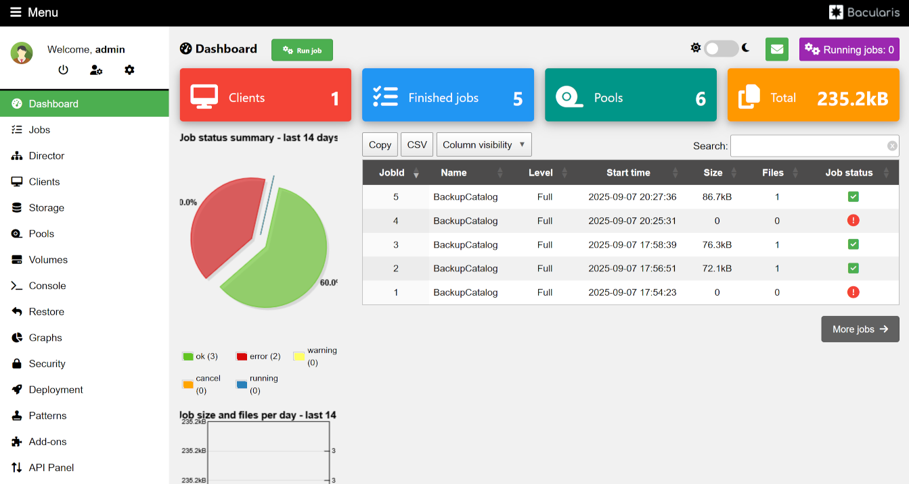

# Bacula 15.0.3 using Docker containers

Deploys the bacula community edition using Docker Containers.

This repository can be used to create and run the Docker containers
for a Bacula server, storage daemon and the web UI [bacularis](https://bacularis.app/)

If you want to use this repo, the [docker-compose.yml](./docker/docker-compose.yml)
will need to be modified, as it makes some assumptions about my home network.

In my setup there is an internal private domain `home.lan`. The host running the
Docker containers has a CNAME alias `bacula.home.lan`. The mail server has the DNS
name `mail.home.lan`.

## Images

- Base image                        asrashley/bacula-base:15.0.3
- Bacula Catalog                    asrashley/bacula-catalog:15.0.3
- Bacula Director                   asrashley/bacula-director:15.0.3
- Bacula Storage Daemon             asrashley/bacularis-sd:15.0.3
- Bacula File Daemon                asrashley/bacula-client:15.0.3
- Bacularis API                     asrashley/bacularis-api-sd:15.0.3
- Bacularis Web Gui                 asrashley/bacularis-web:5.6.0-alpine

## Install Docker

See https://docs.docker.com/engine/install/debian/#install-using-the-repository
for information about adding the Docker repository.

```sh
sudo apt update
sudo apt install docker-ce docker-buildx-plugin docker-compose-plugin
```

## First Time Setup

You need a package key to access the Debian repositories of Bacula
community edition. Go to https://www.bacula.org/bacula-binary-package-download/
to register for a key.

Three system accounts are needed on the Docker host. One for bacula,
one for postgres and one for web daemons. The [first-time-setup.sh](./first-time-setup.sh)
script will look for a user account `bacula`, an account called `postgres` or `mysql`
and an account called `www-data` or `nginx`. If they don't exist, it will create them.

```sh
cd docker
./first-time-setup.sh mykey
```

... where `mykey` is the Bacula access key

The script will create a `.env` file that looks a bit like this:

```
BACULA_KEY=123456789abcd
BACULA_VERSION=15.0.3
BACULA_GID=126
BACULA_UID=116
PG_GID=124
PG_UID=124
WWW_GID=33
WWW_UID=33
EMAIL="ubuntu@home.lan"
HOST_IP="192.168.2.3"
DNS_SERVER="8.8.8.8"
DNS_SEARCH=home.lan
```

## Build the containers

```sh
docker compose build base
docker compose build
```

If the repository key is valid, it should successfully build all of the
conteiners.

## Running the containers

```sh
docker compose up -d
```

If all goes well, all of the services will start and a new database will have
been created in the `bacula-db` container.

The API host should now be available on http://localhost:9097/. The default
username is `admin` with password `admin`.

## Bacularis API First Time Setup

Use the configuration wizard to perform first time setup, and then use the
"Basic users" page to add a user account that will be used by the bacula-web.

### Step 1 - general options

`[*]` Enable API instance

`[*]` Enable web interface

`[*]` Yes. I already have Bacula component(s) installed on this host

Click `Next >`

### Step 2 - share the Bacula Catalog Database

Database type: `PostgreSQL`

Database name: `bacula`

Login: `bacula`

Password: `bacula`

IP address (or hostname): `bacula-db`

Port: `5432`

Click `> test` to check the settings are correct

You should get `OK` confirmation

Click `Next >`

### Step 3 - share the Bacula Bconsole commands interface

Bconsole binary file path: `/usr/sbin/bconsole`

Bconsole admin config file path: `/etc/bacula/bconsole.conf`

Use sudo: `no`

Click `> test` to check the settings are correct

You should get `OK` confirmation

Click `Next >`

### Step 4 - share the Bacula configuration interface

Do you want to setup the Bacula configuration interface?: `yes`

Bacularis working directory for Bacula config: `/var/www/bacularis/protected/vendor/bacularis/bacularis-api/API/Config`

Use sudo: `no`

**Director**

bdirjson binary file path: `/usr/sbin/bdirjson`

Main Director config file path: `/etc/bacula/bacula-dir.conf`

**Storage Daemon**

bsdjson binary file path: `/usr/sbin/bsdjson`

Main Storage Daemon config file path: `/etc/bacula/bacula-sd.conf`

**File Daemon/Client**

bfdjson binary file path: `/usr/sbin/bfdjson`

Main File Daemon config file path: `/etc/bacula/bacula-fd.conf`

**Bconsole**

bbconsjson binary file path: `/usr/sbin/bbconsjson`

Admin Bconsole config file path: `/etc/bacula/bconsole.conf`

Click `> Test configuration` to check the settings are correct

You should get `OK` confirmation

Click `Next >`

### Step 5 - authentication

`[ ]` Use OAuth2 for authorization and authentication

`[*]` Use HTTP Basic authentication

Choose a username and password for the admin account.

Click `Next >`

Click `Save`

The API service will now ask the admin username and password that was just created.

## Bacularis Web First Time Setup

After setting up the API, go to http://localhost:9098/page,WebConfigWizard

### Step 1 - select language

Click `Next >`

### Step 2 - add API instances

Protocol: `HTTP`

IP Address/Hostname: `bacula-api`

`[ ]` Use OAuth2 for authorization and authentication

`[*]` Use HTTP Basic authentication

Enter the username and password from step 5 of the API setup.

Click `> test` to check the settings are correct

You should get `OK` confirmation

Click `Next >`

Click `Save`

Ignore the error about an invalid director. Log out using the power icon on
the top left corner of the page.

Log in again. The "invalid director" message should now be gone and Bacularis
should now be fully working.



## Creating backup clients

To create configurations for clients, you can either use the Bacularis UI,
or create new files in the [etc/clientdefs](./docker/etc/clientdefs/) directory.
Each file must end with the `.conf` extension.

An example client configuration `etc/clientdefs/client2.conf`:

```
Client {
  Name = client2-fd
  Address = 192.168.2.3
  FDPort = 9102
  Catalog = MyCatalog
  Password = "vljflvjdfoj933encdkn9cc33r"
  File Retention = 1 month
  Job Retention = 3 months
  AutoPrune = yes
}

Job {
  Name = "Client2"
  JobDefs = "DefaultJob"
  FileSet = "Full Set"
  Client = client2-fd
  Priority = 10
}

```

The matching `Director` entry in `bacula-fd.conf` that is put on the client device:

```
Director {
  Name = build-3-22-x86_64-dir
  Password = "vljflvjdfoj933encdkn9cc33r"
}

```

## Backup summary reports

To enable a summary email once all jobs for the day have completed, create a
file `etc/scripts/baculabackupreport.ini`. An example `baculabackupreport.ini` file:

```
[DEFAULT]
time = 24
server = Bacula Server
email = snoopy@doghouse.local
smtpserver = my.smtp.server

[baculabackupreport]
dbtype = pgsql
dbhost = bacula-db
dbuser = bacula
dbpass = bacula
time = 48
server = Bacula-15 docker container
always_fail_jobs_threshold = 4
webgui = baculum
webguisvc = http
webguihost = 192.168.169.170
webguiport = 80
urlifyalljobs = True
verified_job_name_col = both
copied_migrated_job_name_col = both
```

The `email` setting should be set to the email account you want to show as the sender
of the summary reports.

The `smtpserver` setting is the hostname or IP address of an smtp server that can deliver
the email.

The `webguihost` setting should be set to the hostname or IP address of the bacula
web container, as seen from the host or devices on the local network. It is used by the
report generator to create HTTP links to the bacula-web container.
